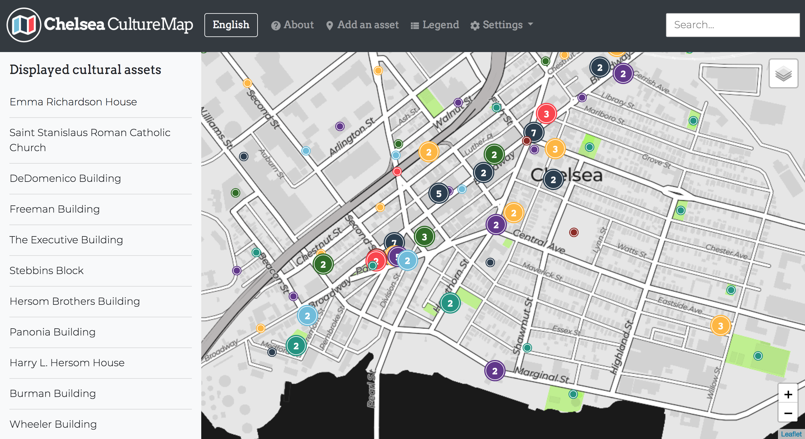
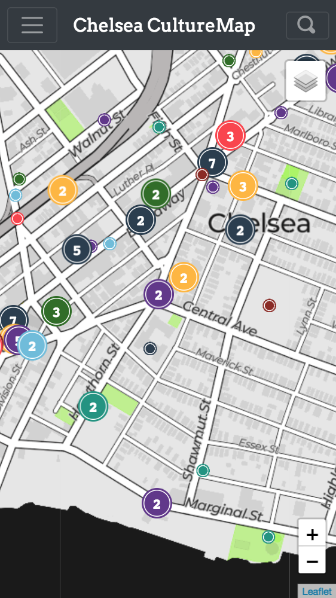

<link href="https://fonts.googleapis.com/icon?family=Material+Icons"
      rel="stylesheet">

## Chelsea CultureMap Documentation

### Introduction

Chelsea CultureMap is an online [cultural asset mapping](http://www.artscapediy.org/Creative-Placemaking-Toolbox/Who-Are-My-Stakeholders-and-How-Do-I-Engage-Them/An-Introduction-to-Cultural-Asset-Mapping.aspx) platform built on top of [ArcGIS Online](https://www.arcgis.com/home/index.html), [Survey123](https://survey123.arcgis.com/), and the [Esri-Leaflet libary](https://esri.github.io/esri-leaflet/). This documentation is for map administrators and for those who would like to extend the platform. Basic administration and data management do not require programming or web development experience, while more advanced customization requires some knowledge of HTML, CSS, and Javascript.

CultureMap is organized around the following workflow:

- Public users can submit new assets via [the survey](https://arcg.is/0XGP9S), which is hosted on [Survey123](https://survey123.arcgis.com/). Public users can access the survey via the [main CultureMap page](https://tohorner.github.io/CultureMap/dist/).
- User-submitted data is stored as a [hosted feature layer](http://doc.arcgis.com/en/arcgis-online/manage-data/hosted-web-layers.htm) on ArcGIS Online. *User-submitted cultural assets do not display on any public-facing maps until approved by an administrator*.
- Administrators can edit cultural asset data in tabular form, using the editor application, or with desktop ArcMap software (see ["Editing Data"](https://tohorner.github.io/CultureMap/docs/#editing-data)).
- Approved data is then displayed on the main Chelsea CultureMap page, which is hosted for free using [GitHub Pages](https://pages.github.com/).

### Understanding the Main CultureMap Page

The main CultureMap page serves as the primary point where public users interact with the application. The page uses the responsive [Twitter Bootstrap]() framework to support both desktop and mobile devices:

*Desktop CultureMap interface*

*Mobile CultureMap interface*

### Working with Survey123

Survey123 is an Esri

### Editing and Managing Data

#### Approving user-submitted cultural assets

#### Adding/removing photos

#### Managing user "voting" data

### Advanced Customization

#### Custom URL

#### Adding/removing cultural asset categories

#### Custom styling

#### Hosting CultureMap
