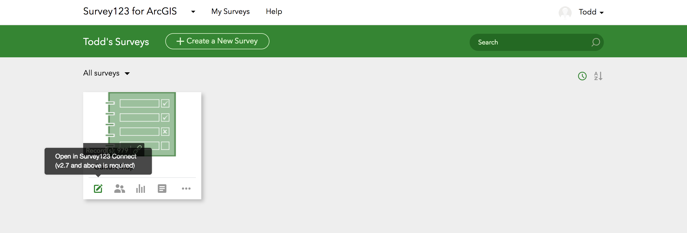

## Chelsea CultureMap Documentation

### Introduction

Chelsea CultureMap is an online [cultural asset mapping](http://www.artscapediy.org/Creative-Placemaking-Toolbox/Who-Are-My-Stakeholders-and-How-Do-I-Engage-Them/An-Introduction-to-Cultural-Asset-Mapping.aspx) platform built on top of [ArcGIS Online](https://www.arcgis.com/home/index.html), [Survey123](https://survey123.arcgis.com/), and the [Esri-Leaflet libary](https://esri.github.io/esri-leaflet/). This documentation is for map administrators and for those who would like to extend the platform. Basic administration and data management do not require programming or web development experience, while more advanced customization requires some knowledge of HTML, CSS, and Javascript.

CultureMap is organized around the following workflow:

- Public users can submit new assets via [the survey](https://arcg.is/0XGP9S), which is hosted on [Survey123](https://survey123.arcgis.com/). Public users can access the survey via the [main CultureMap page](https://tohorner.github.io/CultureMap/dist/).
- User-submitted data is stored as a [hosted feature layer](http://doc.arcgis.com/en/arcgis-online/manage-data/hosted-web-layers.htm) on ArcGIS Online. *User-submitted cultural assets do not display on any public-facing maps until approved by an administrator*.
- Administrators can edit cultural asset data in tabular form, using the editor application, or with desktop ArcMap software (see ["Editing Data"](https://tohorner.github.io/CultureMap/docs/#editing-data)).
- Approved data is then displayed on the main Chelsea CultureMap page, which is hosted for free using [GitHub Pages](https://pages.github.com/).

### CultureMap - the Main Page

The main CultureMap page serves as the primary point where public users interact with the application. The page uses the responsive [Twitter Bootstrap](https://getbootstrap.com/) framework to support both desktop and mobile devices. Users can browse, filter, vote for and search for currently identified cultural assets. They can also access the survey and submit new cultural assets. For a full list of features, consult the [functionality matrix](functionality_matrix.md).

### Working with Survey123

Using [Survey123](https://survey123.arcgis.com/), CultureMap allows users to submit cultural assets for administrator review. When respondents submit a survey, an entry is added to the Core Feature Service, hosted on ArcGIS Online. The survey can be edited by logging into Survey123 and downloading the survey and opening it in Survey123 Connect, a free desktop application, which can be downloaded [here](http://doc.arcgis.com/en/survey123/download/). Detailed Survey123 documentation is available [here](https://doc.arcgis.com/en/survey123/desktop/create-surveys/createfirstsurvey.htm).

*Survey123 dashboard, with survey download displayed.*

With the survey open in Survey123 Connect, administrators can edit question content, add questions, and change question types. Keep in mind, however, that all submitted data fields must correspond with a data field in CultureMaps's Core Feature Service hosted on ArcGIS Online. Both the name and data type (e.g. integer, text) must match. (Managing and editing data is covered below.)

Survey123 Connect allows users to create and edit surveys in Microsoft Excel using the [XLS Forms specification](http://xlsform.org/). Esri has published [detailed documentation](https://doc.arcgis.com/en/survey123/desktop/create-surveys/xlsformessentials.htm) for how to work with XLS Forms to create and edit Survey123 surveys.

*Screenshot from the OS X version of Survey123 Connect. The survey specification can be opened in Microsoft Excel by clicking on the icon in the upper left-hand corner. (Survey123 Connect is available for Windows, but the user interface may not be identical.)*

*Screenshot from an Survey123 survey, open for editing in Microsoft Excel*

### Editing and Managing Data

#### Editing methods

CultureMap provides administrators with three primary avenues for managing and editing cultural asset data: an online data spreadsheet, a map-based editor application, and ArcMap desktop software.

##### Online data spreadsheet

The Core Feature Service, which stores all of CultureMap's cultural asset data, can be accessed via the Content tab of the administrator's ArcGIS Online dashboard. The Core Feature Service is stored in a directory named `Chelsea_CultureMap`.

*ArcGIS Online dashboard, with contents of* `Chelsea_CultureMap` *displayed*.

After clicking on the Core Feature Service, an administrator can edit cultural asset data by clicking on the "data" tab and double-clicking on individual cells. Note that the spreadsheet interface allows administrators to *edit* asset data, but not *create* or *delete* rows of data. Fields (columns) can be added or deleted.

*Core Feature Service, displayed in spreadsheet form*

##### Editor Application

The folder `Chelsea_CultureMap` contains a editor application named `Asset Editor`. Once on the item page for the `Asset Editor`, administrators can click on "View Application," to launch the editing app. The editing application is also accessible from the main CultureMap page, under `Settings > For Administrators`.

*Item page for the* `Asset Editor`.

With the `Editor App` open, administrators can filter assets by major category and approval status. The filter can be toggled by clicking the funnel icon in the upper-left corner. In the `STATUS` dropdown menu, `0` denotes unapproved assets, while `1` denotes approved assets.

*Editor app with filter menu displayed*

Administrators can edit assets by either clicking the pencil/list icon in the upper-left corner or clicking an asset and then the ellipses in the asset's popup window.

##### Desktop ArcMap Software

Desktop ArcMap software allows users to download a local copy of hosted feature layers, make edits, and then synchronize those edits with the hosted layer. For details, please consults the ArcMap documentation [here](http://desktop.arcgis.com/en/arcmap/10.3/manage-data/editing-fundamentals/about-editing-data-from-feature-services.htm).

#### Approving user-submitted cultural assets

Display of cultural assets on public-facing cultural asset map is controlled by the `STATUS` field in the Core Feature Service. Cultural assets will appear on the map only if `STATUS` is set to `1`. The `STATUS` field uses the following convention for denoting the status of a cultural asset.

| Value | Description        |
| ----- | ------------------ |
| `1`   | Approved           |
| `0`   | Unapproved         |
| `-1`  | Rejected           |
| `2`   | More info required |

Administrators can edit the `STATUS` field using any of the three methods described above. Note that all survey responses are timestamped, so administrators can use the Core Feature Service spreadsheet interface to sort cultural assets by time submitted, allowing for easy review of the most recent submissions.

#### Managing photos

When a public user clicks on a cultural asset on the public-facing cultural asset map, a pop-up window appears that contains asset information, including photos, if available. CultureMap uses two methods for displaying images: photo attachments and a publicly-accessible URL.

##### Photo attachments

If photos are attached to a cultural asset, then CultureMap will display those photos in the asset's pop-up window. Photos can be attached to a cultural asset either by submitting a photo along with a survey response or by adding photos via Core Feature Service's spreadsheet interface.

If more than one photo is attached, then the asset's popup window will display a "carousel" gallery of all available images. For best results, photos should be sized the same, using a landscape orientation.

*Core Feature Service data spreadsheet, with photo attachment field displayed to the right.*

##### Public URL

If photos are not attached to a given asset, then CultureMap will display the photo specified under `PIC_URL` of the Core Feature Service. The field must contain a valid, publicly-accessible URL. If no URL is provided, then the popup will simply omit a picture.

#### Managing user "voting" data

Public CultureMap users can "like" identified cultural assets by clicking on the thumbs-up icon in the upper-right corner of each asset's popup. Each "like" is recorded in the hosted table `votes`, stored within the `Chelsea_CultureMap` folder. The `votes` table contains the following fields:

| Field      | Description                                                                                     |
| ---------- | ----------------------------------------------------------------------------------------------- |
| `ASSET_ID` | ID of cultural asset, as specified in the Core Feature Service                                  |
| `NAME`     | Name of cultural asset                                                                          |
| `IP`       | IP address of voter. IP tracking not currently implemented                                      |
| `LOCATION` | General location of voter, as given by an IP georeferencing service. Not currently implemented. |

The table also includes timestamps of when the vote was made/edited. These fields can be turned on by clicking the menu icon in the table's upper right-hand corner and selecting "Show/Hide Columns."

*Cultural asset popup window, with like button in upper right-hand corner*

#### Core Feature Service Specification

The Core Feature Service includes the following fields:

| Field          | Description                                                                                                        |
| -------------- | ------------------------------------------------------------------------------------------------------------------ |
| `NAME`         | Name of the cultural asset.                                                                                        |
| `TAB_NAME`     | Primary category of cultural asset.                                                                                |
| `PIC_URL`      | A publicly-accessible URL of photo to display, if no pictures are attached to asset.                               |
| `THUMB_URL`    | Thumbnail of asset. Not currently used.                                                                            |
| `ADDRESS`      | Street address of asset, if available.                                                                             |
| `SUBCATEGORY1` | Primary subcategory of asset.                                                                                      |
| `CATEGORY2`    | Secondary asset category (optional)                                                                                |
| `SUBCATEGORY2` | Secondary subateogry (optional)                                                                                    |
| `MAKER`        | The individual or organization that created the cultural asset, if known.                                          |
| `FUNDER`       | The individual or organization that crated the cultural asset, if known.                                           |
| `WEBSITE`      | Website of cultural asset. The asset popup window links to the webste.                                             |
| `MACRIS_ID`    | MA Historical Commission ID number, if available.                                                                  |
| `ASSETYEAR`    | The year the asset was created/founded/initiated.                                                                  |
| `STATUS`       | Approval status (see above)                                                                                        |
| `SOURCE`       | Source of asset information (optional)                                                                             |
| `DESCRIPTION`  | Description of asset to display in popup window. Valid HTML is accepted.                                           |
| `TAGS`         | Tags associated with the asset. Not currently used, but could allow for future organizaito or filtering of assets. |
| *Attachments*  | Attached photos.
                                                                                                                   |
### Advanced Customization

#### Custom URL

#### Adding/removing cultural asset categories

#### Custom styling

#### Hosting CultureMap
